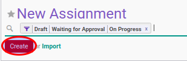
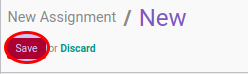

# Membuat New Assignment Transition

## A. INPUT

*(Tidak ada prasyarat khusus)*

## B. INSTRUKSI KERJA

1. Buka menu **Human Resources -> Career Transition -> New Assignments**. Abaikan jika sudah berada pada menu yang dimaksud.
2. Klik tombol **Create** pada bagian atas-kiri form.

3. Isi dan sesuaikan **[# Document](./penjelasan.md#field-document)** jika dibutuhkan. Harus diisi.
4. Pilih **[Company](./penjelasan.md#field-company)**. Harus diisi.
5. Isi **[Effective Date](./penjelasan.md#field-effective-date)**. Harus diisi.
6. Pilih **[Reason](./penjelasan.md#field-reason)**. Tidak harus diisi.
7. Aktifkan **[Archieve](./penjelasan.md#field-archieve)** jika dibutuhkan.
8. Pilih **[Employee](./penjelasan.md#field-employee)**. Harus diisi.
9. Buka tab [**Career Transition Detail**](./penjelasan.md#tab-career).
10. Pilih **[Company](./penjelasan.md#field-transisi-company)**. Harus diisi.
11. Pilih **[Department](./penjelasan.md#field-transisi-departement)**. Harus diisi.
12. Pilih **[Job](./penjelasan.md#field-transisi-job)**. Harus diisi.
13. Pilih **[Job Grade](./penjelasan.md#field-transisi-job-grade)**. Harus diisi.
14. Pilih **[Working Schedule](./penjelasan.md#field-transisi-working-schedule)**. Harus diisi.
15. Pilih **[Salary Structure](./penjelasan.md#field-transisi-salary-structure)**. Harus diisi.
16. <a name="l16">[Tambah](./menambahkan-payslip-input.md)/[Modifikasi](./modifikasi-payslip-input.md)/[Hapus](./menghapus-payslip-input.md)</a> [**Input Types**](./penjelasan.md#tabel-input-types).
17. <a name="l17">Pilih **[Analytic Account](./penjelasan.md#field-transisi-analytic-account)**. Harus diisi.</a>
18. <a name="l18">[Tambah](./menambahkan-timesheet-computation.md)/[Modifikasi](./modifikasi-timesheet-computation.md)/[Hapus](./menghapus-timesheet-computation.md)</a> [**Timesheet Computations**](./penjelasan.md#tabel-timesheet-computation).
19. <a name="l19">Klik tombol **Save** pada bagian atas-kiri form.</a>

## C. OUTPUT

* Data new assignment transition akan terbuat dengan status **Draft**.

