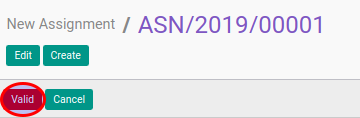
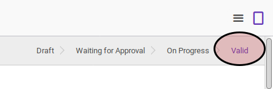

# Memvalidasi New Assignment Transition

## A. INPUT

* Data new assignment transition yang akan divalidasi harus memiliki status **On Progress**.

* User yang akan memvalidasi harus memiliki akses untuk memvalidasi new assignment transition.

## B. INSTRUKSI KERJA

1. Buka menu **Human Resources -> Career Transition -> New Assignments**. Abaikan jika sudah berada pada menu yang dimaksud.
2. Buka data new assignments transition yang akan divalidasi. Abaikan jika data sudah dibuka.
3. Klik tombol **Valid** pada bagian atas-kiri form.

## C. OUTPUT

* Data new assignments transition akan berubah menjadi **Valid**.

