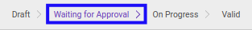

# Mengkonfirmasi New Assignment Transition

## A. INPUT

* Data new assignment transition yang akan dikonfirmasi harus memiliki status **Draft**.

* User yang akan mengkonfirmasi harus memiliki akses untuk mengkonfirmasi new assignment transition.

## B. INSTRUKSI KERJA

1. Buka menu **Human Resources -> Career Transition -> New Assignments**. Abaikan jika sudah berada pada menu yang dimaksud.
2. Buka data new assignment transition yang akan dikonfirmasi. Abaikan jika data sudah dibuka.
3. Klik tombol **Confirm** pada bagian atas-kiri form.

## C. OUTPUT

* Data new assignment transition akan berubah menjadi **Waiting for Approval**.

* Data new assignment transition sudah tidak bisa dimodifikasi.
