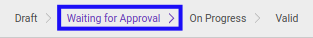
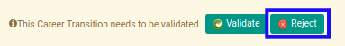

# Menolak New Assignment Transition

## A. INPUT

* Data *new assignment transition* yang akan ditolak harus memiliki status **Waiting for Approval**.

* User yang akan menolak harus memiliki akses untuk menolak *new assignment transition*.

## B. INSTRUKSI KERJA

1. Buka menu **Human Resources -> Career Transition -> New Assignments**. Abaikan jika sudah berada pada menu yang dimaksud.
2. Buka data *new assignment transition* yang akan ditolak. Abaikan jika data sudah dibuka.
3. Klik tombol **Reject** pada bagian atas-kiri form.

## C. OUTPUT

* Data *new assignment transition* telah ditolak.

