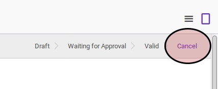
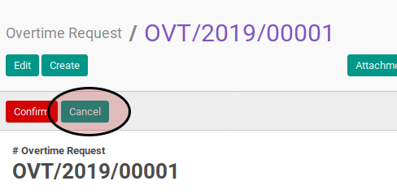

# Membatalkan Overtime

## A. INPUT

* Data overtime yang akan dibatalkan tidak boleh memiliki status **Cancel**.

* User yang akan membatalkan harus memiliki akses untuk membatalkan overtime.

## B. LANGKAH KERJA

1. Buka menu **Human Resources -> Overtime -> Overtime Request**. Abaikan jika sudah berada pada menu yang dimaksud.
2. Buka data overtime yang akan dibatalkan. Abaikan jika data sudah dibuka.
3. Klik tombol **Cancel** pada bagian atas-kiri form.

## C. OUTPUT

* Data overtime akan berubah menjadi **Cancel**.

