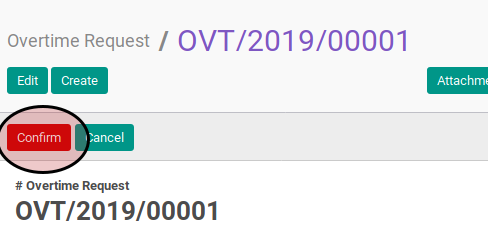
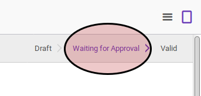

# Mengkonfirmasi Overtime

## A. INPUT

* Data overtime yang akan dikonfirmasi harus memiliki status **Draft**.

* User yang akan mengkonfirmasi harus memiliki akses untuk mengkonfirmasi overtime.

## B. LANGKAH KERJA

1. Buka menu **Human Resources -> Overtime -> Overtime Request**. Abaikan jika sudah berada pada menu yang dimaksud.
2. Buka data overtime yang akan dikonfirmasi. Abaikan jika data sudah dibuka.
3. Klik tombol **Confirm** pada bagian atas-kiri form.

## C. OUTPUT

* Data overtime akan berubah menjadi **Waiting for Approval**.

