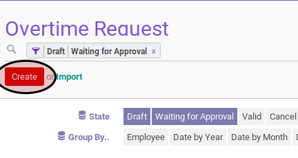
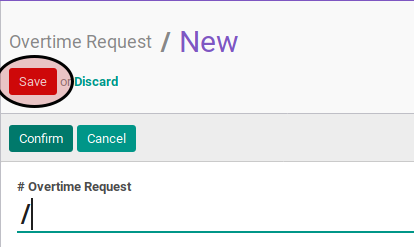
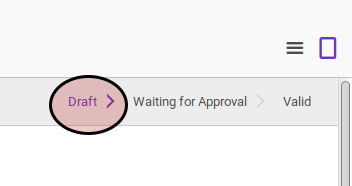

# Membuat Overtime

## A. INPUT

*(Tidak ada penjelasan khusus)*

## B. INSTRUKSI KERJA

1. Buka menu **Human Resources -> Overtime -> Overtime Request**. Abaikan jika sudah berada pada menu yang dimaksud.
2. Klik tombol **Create** pada bagian atas-kiri form.

3. Isi dan sesuaikan **[# Overtime Request](./penjelasan.md#field-overtime-request)** . Harus diisi.
4. Pilih **[Company](./penjelasan.md#field-company)**. Harus diisi.
5. Pilih **[Employee](./penjelasan.md#field-employee)**. Harus diisi.
6. Isi **[Date Start](./penjelasan.md#field-date-start)**. Harus diisi.
7. Isi **[Date End](./penjelasan.md#field-date-end)**. Harus diisi.
8. Buka tab **Note**.
9. Isi **[Note](./penjelasan.md#field-note)**. Tidak harus diisi.
10. Klik tombol **Save** pada bagian atas-kiri form.

## C. OUTPUT

* Data overtime akan terbuat dengan status **Draft**.

