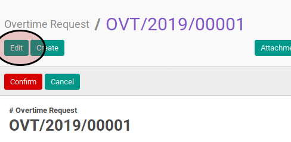

# Memodifikasi Overtime

## A. INPUT

* Data overtime yang akan dimodifikasi harus memiliki status **Draft**.

## B. INSTRUKSI KERJA

1. Buka menu **Human Resources -> Overtime -> Overtime Request**. Abaikan jika sudah berada pada menu yang dimaksud.
2. Buka data overtime yang akan dimodifikasi. Abaikan jika data sudah dibuka.
3. Klik tombol **Edit** pada bagian atas-kiri form.

4. Isi dan sesuaikan **# Overtime Request** . Harus diisi.
5. Pilih dan sesuaikan **Company**. Harus diisi.
6. Pilih dan sesuaikan **Employee**. Harus diisi.
7. Isi dan sesuaikan **Date Start**. Harus diisi.
8. Isi dan sesuaikan **Date End**. Harus diisi.
9. Buka tab **Note**.
10. Isi  dan sesuaikan **Note**. Tidak harus diisi.
11. Klik tombol **Save** pada bagian atas-kiri form.

## C. OUTPUT

* Data overtime akan terbuat dengan status **Draft**.

