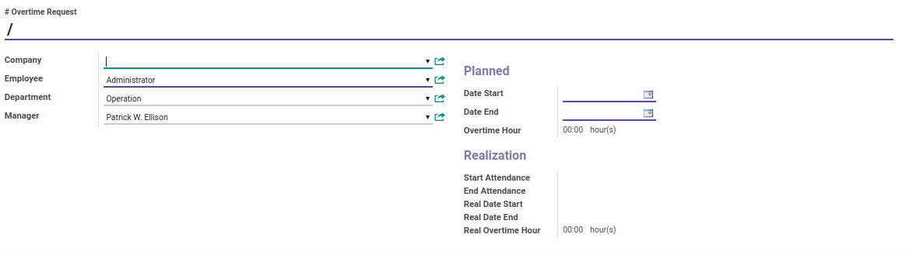
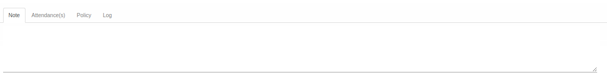
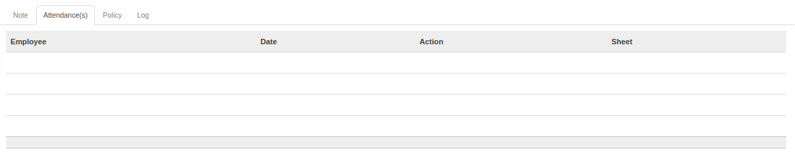
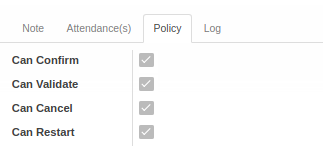
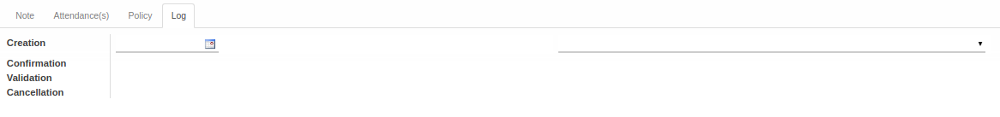

# Penjelasan Overtime

Informasi pada Overtime dibagi menjadi beberapa area, diantaranya:
* [Header](#bagian-header)
* [Tab Note](#tab-note)
* [Tab Attendance(s)](#tab-attendances)
* [Tab Policy](#tab-policy)
* [Tab Log](#tab-log)

### <a name="bagian-header">HEADER</a>

#### <a name="field-overtime-request"># Overtime Request</a>

Nomor *Overtime*

#### <a name="field-company">Company</a>

Mendefinisikan perusahaan tempat karyawan berkerja

#### <a name="field-department">Department</a>

Mendefinisikan departemen tempat karyawan berkerja

#### <a name="field-manager">Manager</a>

Mendefinisikan manajer karyawan

#### <a name="field-date-start">Date Start</a>

Mendefinisikan tanggal dimulainya *Overtime*

#### <a name="field-date-end">Date End</a>

Mendefinisikan tanggal berakhirnya *Overtime*

#### <a name="field-overtime-hour">Overtime Hour</a>

Menginformasikan total jam *Overtime* berdasarkan *Date End* dan *Date Start*

#### <a name="field-start-att">Start Attendance</a>

Menginformasikan jam absen dimulainya *Overtime*

#### <a name="field-end-att">End Attendance</a>

Menginformasikan jam absen berakhirnya *Overtime*

#### <a name="field-real-date-start">Real Date Start</a>

Mendefinisikan realisasi tanggal dimulainya *Overtime*

#### <a name="field-real-date-end">Real Date End</a>

Mendefinisikan realisasi tanggal berakhirnya *Overtime*

#### <a name="field-real-overtime-hour">Real Overtime Hour</a>

Menginformasikan realisasi total jam *Overtime* berdasarkan *Date End* dan *Date Start*

### <a name="tab-note">TAB NOTE</a>

#### <a name="field-note">Note</a>

Catatan tambahan terkait *Overtime*

### <a name="tab-attendances">TAB ATTENDANCE(S)</a>

#### <a name="field-tab-attendances-details">Attendance(s)</a>

Menginformasikan detail absen karyawan terkait *Overtime*

### <a name="tab-policy">TAB POLICY</a>

#### <a name="field-can-confirm">Can Confirm</a>

Diisi otomatis oleh Odoo. Jika aktif, maka user yang membuka data *Overtime* dapat melakukan proses [Mengkonfirmasi Overtime](./konfirmasi.md).

#### <a name="field-can-validate">Can Validate</a>

Diisi otomatis oleh Odoo. Jika aktif, maka user yang membuka data *Overtime* dapat melakukan proses [Memvalidasi Overtime](./validasi.md).

#### <a name="field-can-cancel">Can Cancel</a>

Diisi otomatis oleh Odoo. Jika aktif, maka user yang membuka data *Overtime* dapat melakukan proses [Membatalkan Overtime](./batal.md).

#### <a name="field-can-restart">Can Restart</a>

Diisi otomatis oleh Odoo. Jika aktif, maka user yang membuka data *Overtime* dapat melakukan proses [Merestart Overtime](./restart.md).

### <a name="tab-log">TAB LOG</a>

#### <a name="field-log-creation">Creation</a>

Diisi otomatis oleh Odoo. Tanggal, waktu dan user yang [Membuat Overtime](./membuat.md).

#### <a name="field-log-confirmation">Confirmation</a>

Diisi otomatis oleh Odoo. Tanggal, waktu dan user yang [Mengkonfirmasi Overtime](./konfirmasi.md).

#### <a name="field-log-validation">Validation</a>

Diisi otomatis oleh Odoo. Tanggal, waktu, dan user yang [Memvalidasi Overtime](./validasi.md).

#### <a name="field-log-cancellation">Cancellation</a>

Diisi otomatis oleh Odoo. Tanggal, waktu, dan user yang [Membatalkan Overtime](./batal.md).
