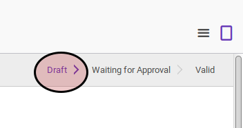

# Merestart Overtime

## A. INPUT

* Data overtime yang akan direstart harus memiliki status **Waiting for Approval**.

* User yang akan merestart harus memiliki akses untuk merestart overtime.

## B. LANGKAH KERJA

1. Buka menu **Human Resources -> Overtime -> Overtime Request**. Abaikan jika sudah berada pada menu yang dimaksud.
2. Buka data overtime yang akan direstart. Abaikan jika data sudah dibuka.
3. Klik tombol **Restart** pada bagian atas-kiri form.

## C. OUTPUT

* Data overtime akan berubah menjadi **Draft**.

