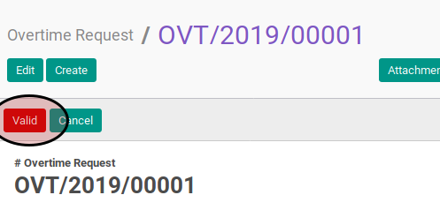
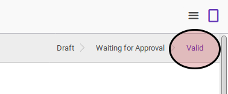

# Memvalidasi Overtime

## A. INPUT

* Data overtime yang akan divalidasi harus memiliki status **Waiting for Approval**.

* User yang akan memvalidasi harus memiliki akses untuk memvalidasi overtime.

## B. LANGKAH KERJA

1. Buka menu **Human Resources -> Overtime -> Overtime Request**. Abaikan jika sudah berada pada menu yang dimaksud.
2. Buka data overtime yang akan divalidasi. Abaikan jika data sudah dibuka.
3. Klik tombol **Valid** pada bagian atas-kiri form.

## C. OUTPUT

* Data overtime akan berubah menjadi **Valid**.

