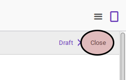
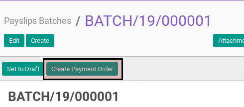
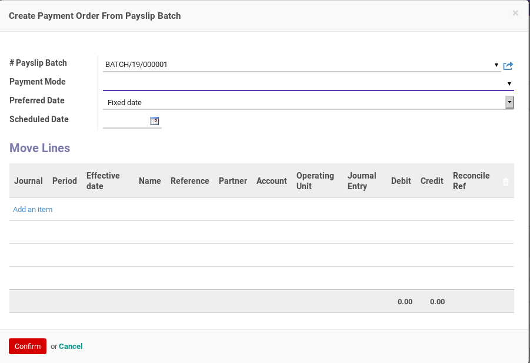
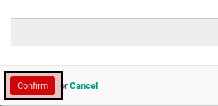

# Membuat Payment Order Dari Payslip Batch

* Data payslip batch yang akan diselesaikan harus memiliki status **Close**.

## B. LANGKAH KERJA

1. Buka menu **Human Resource -> Payroll -> Payslip Batch**. Abaikan jika sudah berada pada menu yang dimaksud.
2. Buka data payslip batch yang akan dimodifikasi. Abaikan jika data sudah dibuka.
3. Klik tombol **Create Payment Order** pada bagian atas-kiri form.

4. Pop-up **Create Payment Order** akan muncul.

5. Pilih **Payment Mode**. Harus diisi.
6. Pilih **Preferred Date**. Harus diisi.
7. Lanjutkan ke langkah ke-9 jika **Preferred Date** diisi selain **Fixed Date**.
8. Isi **Schedule Date**. Harus diisi.
9. <a name="l9">[Tambah](./menambah-move-line.md)/[Hapus](./menghapus-move-line.md)</a> **Move Lines** yang akan dibuatkan payment ordernya. Ulangi langkah ini sampai tabel **Move Lines** sesuai dengan keinginan.
10. Klik tombol **Confirm** pada bagian bawah-kiri pop-up **Create Payment Order**.

## C. OUTPUT

* Data payment order akan terbuat.
