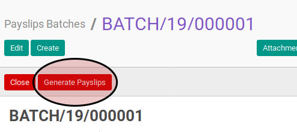
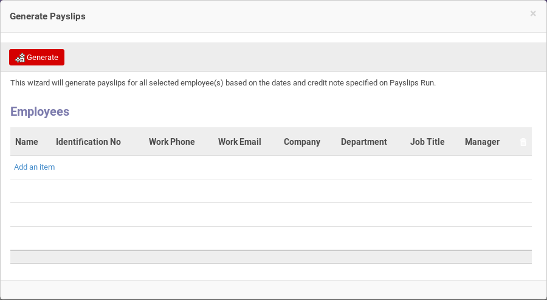
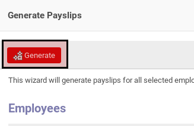

# Membuat Payslip Dari Payslip Batch

* Data payslip batch yang akan dibuatkan payslipnya harus memiliki status **Draft**.

## B. LANGKAH KERJA

1. Buka menu **Human Resource -> Payroll -> Payslip Batch**. Abaikan jika sudah berada pada menu yang dimaksud.
2. Buka data payslip batch yang akan dimodifikasi. Abaikan jika data sudah dibuka.
3. Klik tombol **Generate Payslips** pada bagian atas-kiri form.

4. Pop-up **Generate Payslip** akan muncul.

5. <a name="l5">[Tambah](./menambahkan-karyawan.md)/[Hapus](./menghapus-karyawan.md)</a> karyawan yang akan dibuatkan payslipnya. Ulangi langkah ini sampai tabel **Employee** sesuai dengan keinginan.
6. Klik tombol **Generate** pada bagian atas-kiri form.

## C. OUTPUT

* Data payslip akan terbuat sebanyak karyawan yang dipilih pada [langkah ke-5](#l5).
