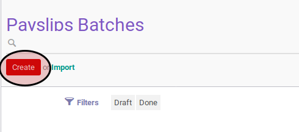
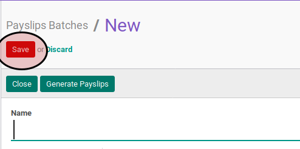
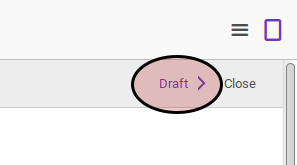

# Membuat Payslip Batch

## A. INPUT

*(Tidak ada instruksi khusus)*

## B. LANGKAH KERJA

1. Buka menu **Human Resource -> Payroll -> Payslip Batch**. Abaikan jika sudah berada pada menu yang dimaksud.
2. Klik tombol **Create** pada bagian atas-kiri form.

3. Isi **Name**. Harus diisi.
4. Isi **Period Start**. Harus diisi.
5. Isi **Period End**. Harus diisi.
6. Isi **Salary Journal**. Harus diisi.
7. Isi **Payslip Type**. Harus diisi.
8. Isi **Force Move Date**. Harus diisi.
9. Klik tombol **Save** pada bagian atas-kiri form.

## C. OUTPUT

* Data payslip batch akan terbuat dengan status **Draft**

