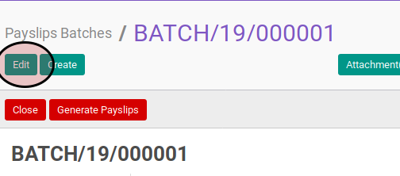

# Memodifikasi Payslip Batch

## A. INPUT

* Data payslip batch yang akan dimodifikasi harus memiliki status **Draft**.

## B. LANGKAH KERJA

1. Buka menu **Human Resource -> Payroll -> Payslip Batch**. Abaikan jika sudah berada pada menu yang dimaksud.
2. Buka data payslip batch yang akan dimodifikasi. Abaikan jika data sudah dibuka.
3. Klik tombol **Edit** pada bagian atas-kiri form.

4. Isi dan sesuaikan **Name** jika dibutuhkan. Harus diisi.
5. Isi dan sesuaikan **Period Start** jika dibutuhkan. Harus diisi.
6. Isi dan sesuaikan **Period End** jika dibutuhkan. Harus diisi.
7. Isi dan sesuaikan **Salary Journal** jika dibutuhkan. Harus diisi.
8. Isi dan sesuaikan **Payslip Type** jika dibutuhkan. Harus diisi.
9. Isi dan sesuaikan **Force Move Date** jika dibutuhkan. Harus diisi.
10. Klik tombol **Save** pada bagian atas-kiri form.

## C. OUTPUT

* Data payslip batch berubah sesuai dengan perubahan yang dilakukan.
