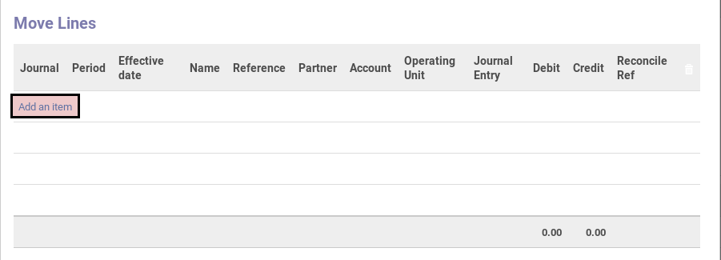
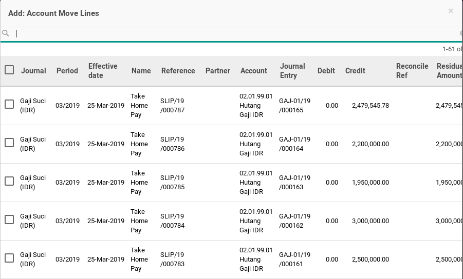
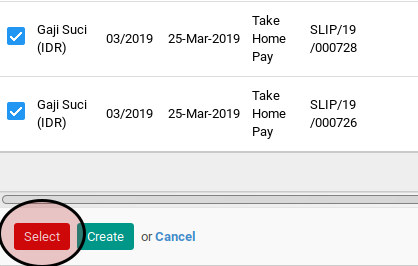

# Menambahkan Move Line

*(Instruksi kerja ini merupakan sub instruksi dari (1) [Membuat Payment Order Dari Payslip Batch](./membuat-payment-order.md). Instruksi kerja ini tidak bisa berdiri sendiri)*

## A. INPUT

*(Tidak ada instruksi khusus)*

## B. LANGKAH KERJA

1. Klik label **Add an Item** pada tabel **Move Lines**.

2. Pop-up **Add: Account Move Lines** akan muncul.

3. Pilih data move line.
4. Klik tombol **Select** pada bagian bawah-kiri pop-up **Add: Account Move Lines**.

5. Lanjutkan [langkah ke-9 instruksi kerja Membuat Payment Order Dari Payslip Batch](./membuat-payment-order.md#l9).

## C. OUTPUT

*(Tidak ada instruksi khusus)*
