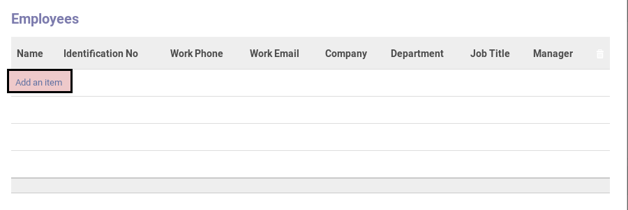
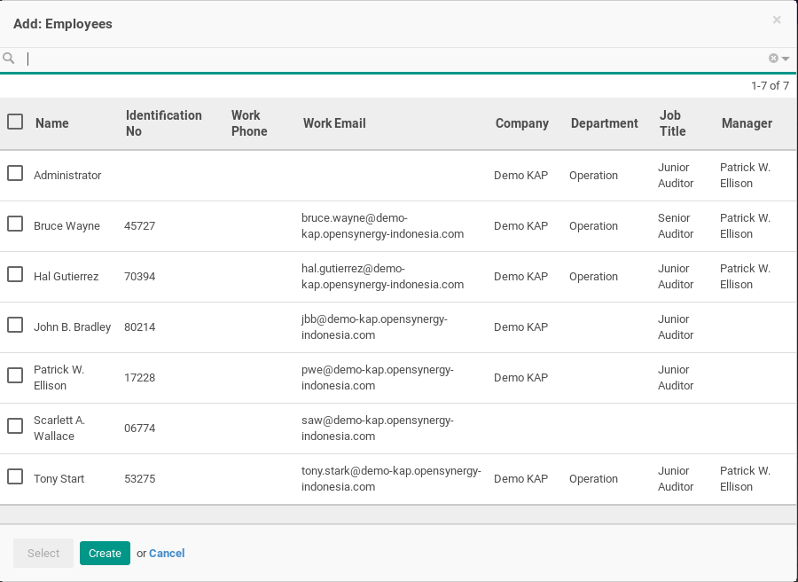
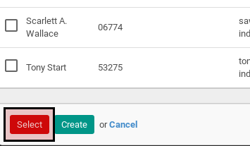

# Menambahkan Karyawan Yang Akan Dibuatkan Payslip

*(Instruksi kerja ini merupakan sub instruksi dari (1) [Membuat Payslip Dari Payslip Batch](./membuat-payslip.md). Instruksi kerja ini tidak bisa berdiri sendiri)*

## A. INPUT

*(Tidak ada instruksi khusus)*

## B. LANGKAH KERJA

1. Klik label **Add an Item** pada tabel **Employee**.

2. Pop-up **Add: Employee** akan muncul.

3. Pilih data employee.
4. Klik tombol **Select** pada bagian bawah-kiri pop-up **Add: Employee**.

5. Lanjutkan [langkah ke-5 instruksi kerja Membuat Payslip Dari Payslip Batch](./membuat-payslip.md#l5).

## C. OUTPUT

*(Tidak ada instruksi khusus)*
