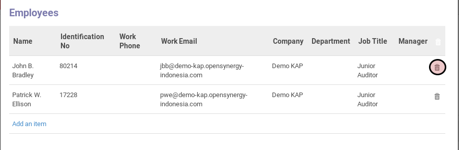

# Menghapus Karyawan Yang Akan Dibuatkan Payslip

*(Instruksi kerja ini merupakan sub instruksi dari (1) [Membuat Payslip Dari Payslip Batch](./membuat-payslip.md). Instruksi kerja ini tidak bisa berdiri sendiri)*

## A. INPUT

*(Tidak ada instruksi khusus)*

## B. LANGKAH KERJA

1. Klik icon tempat sampah pada bagian kanan data karyawan yang akan dihapus.

2. Lanjutkan [langkah ke-5 instruksi kerja Membuat Payslip Dari Payslip Batch](./membuat-payslip.md#l5).

## C. OUTPUT

*(Tidak ada instruksi khusus)*
