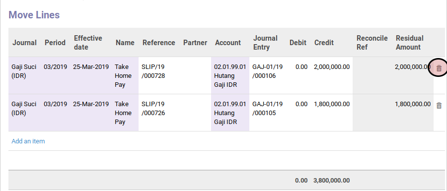

# Menghapus Move Line

*(Instruksi kerja ini merupakan sub instruksi dari (1) [Membuat Payment Order Dari Payslip Batch](./membuat-payment-order.md). Instruksi kerja ini tidak bisa berdiri sendiri)*

## A. INPUT

*(Tidak ada instruksi khusus)*

## B. LANGKAH KERJA

1. Klik icon tempat sampah pada bagian kanan data move line yang akan dihapus.

2. Lanjutkan [langkah ke-9 instruksi kerja Membuat Payment Order Dari Payslip Batch](./membuat-payment-order.md#l9).

## C. OUTPUT

*(Tidak ada instruksi khusus)*
