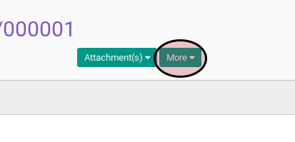
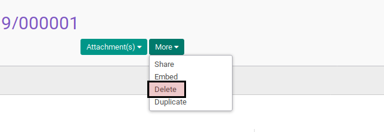
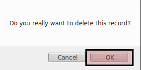

# Menghapus Payslip Batch

## A. INPUT

* Data payslip batch yang akan dihapus harus memiliki status **Draft**.

## B. LANGKAH KERJA

1. Buka menu **Human Resources -> Payroll -> Payslip Batch**. Abaikan jika sudah berada pada menu yang dimaksud.
2. Buka data payslip batch yang akan dihapus. Abaikan jika data sudah dibuka.
3. Klik tombol **More** pada bagian atas-tengah form.

4. Klik tombol **Delete** pada drop-down yang muncul dari tombol **More**.

5. Klik tombol **Ok** pada konfirmasi penghapusan yang muncul

## C. OUTPUT

* Data payslip batch akan terhapus.
