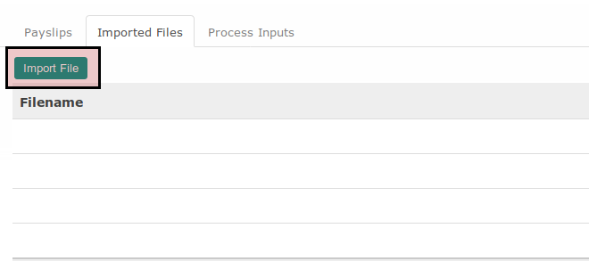
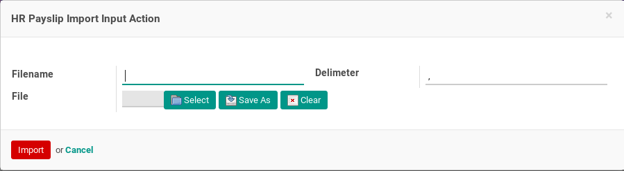
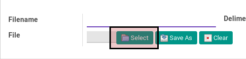
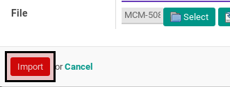

# Mengimport Payslip Input

* Data payslip batch yang akan diimport payslip inputnya harus memiliki status **Draft**.

## B. LANGKAH KERJA

1. Buka menu **Human Resource -> Payroll -> Payslip Batch**. Abaikan jika sudah berada pada menu yang dimaksud.
2. Buka data payslip batch yang akan dimodifikasi. Abaikan jika data sudah dibuka.
3. Buka tab **Imported Files**.
4. Klik tombol **Import File**.

5. Pop-up **HR Payslip Import Input Action** akan muncul.

6. Klik tombol **Select** pada pop-up **HR Payslip Import Input Action**.

7. Pilih file yang akan diimport.
8. Klik tombol **Import** pada bagian bawah-kiri Pop-up **HR Payslip Import Input Action**.

## C. OUTPUT

*(Tidak ada instruksi khusus)*
