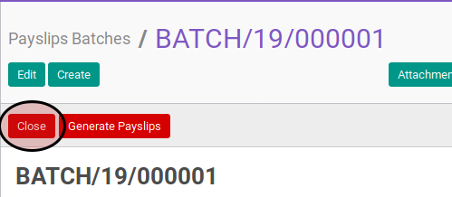

# Menyelesaikan Payslip Batch

* Data payslip batch yang akan diselesaikan harus memiliki status **Draft**.

## B. LANGKAH KERJA

1. Buka menu **Human Resource -> Payroll -> Payslip Batch**. Abaikan jika sudah berada pada menu yang dimaksud.
2. Buka data payslip batch yang akan dimodifikasi. Abaikan jika data sudah dibuka.
3. Klik tombol **Close** pada bagian atas-kiri form.

## C. OUTPUT

* Status payslip batch akan berubah menjadi **Close**

