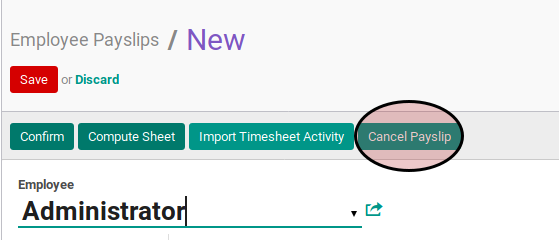

# Membatalkan Payslip

## A. INPUT

* Data payslip yang akan dibatalkan harus memiliki status **Draft** atau **Done**

* User yang akan membatalkan harus memiliki akses untuk membatalkan payslip.

## B. LANGKAH KERJA

1. Buka menu **Human Resources -> Payroll -> Employee Payslip**. Abaikan jika sudah berada pada menu yang dimaksud.
2. Buka data payslip yang akan dibatalkan. Abaikan jika data sudah dibuka.
3. Klik tombol **Cancel Payslip** pada bagian atas-kiri form.

## C. OUTPUT

* Data payslip akan berubah menjadi **Rejected**.

