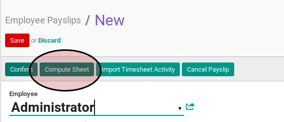

# Menghitung Payslip

## A. INPUT

* Data payslip yang akan dihitung harus memiliki status **Draft**.

* User yang akan menghitung harus memiliki akses untuk menghitung payslip.

## B. LANGKAH KERJA

1. Buka menu **Human Resources -> Payroll -> Employee Payslip**. Abaikan jika sudah berada pada menu yang dimaksud.
2. Buka data payslip yang akan dihitung. Abaikan jika data sudah dibuka.
3. Klik tombol **Compute Sheet** pada bagian atas-kiri form.

## C. OUTPUT

* Data perhitungan gaji pada tab **Salary Computation** akan dihitung/dihitung ulang
