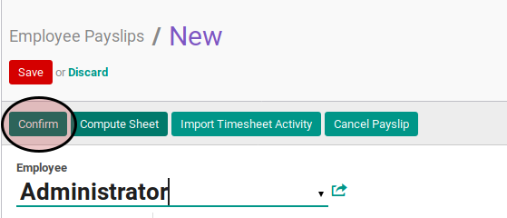
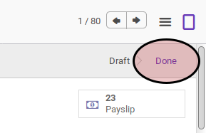

# Mengkonfirmasi Payslip

## A. INPUT

* Data payslip yang akan dikonfirmasi harus memiliki status **Draft**.

* User yang akan mengkonfirmasi harus memiliki akses untuk mengkonfirmasi payslip.

## B. LANGKAH KERJA

1. Buka menu **Human Resources -> Payroll -> Employee Payslip**. Abaikan jika sudah berada pada menu yang dimaksud.
2. Buka data payslip yang akan dikonfirmasi. Abaikan jika data sudah dibuka.
3. Klik tombol **Confirm** pada bagian atas-kiri form.

## C. OUTPUT

* Data payslip akan berubah menjadi **Done**.

