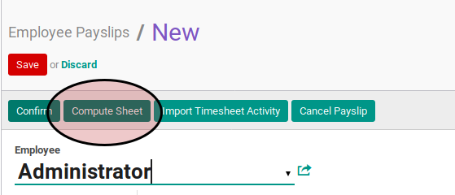
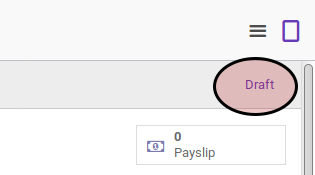

# Membuat Payslip

## A. INPUT

*(Tidak ada instruksi khusus)*

## B. LANGKAH KERJA

1. Buka menu **Human Resources -> Payroll -> Employee Payslip**. Abaikan jika sudah berada pada menu yang dimaksud.
2. Klik tombol **Create** pada bagian atas-kiri form.

3. Pilih **Employee**. Harus diisi.
4. Pilih **Period Date Start**. Harus diisi.
5. Pilih **Period Date End**. Harus diisi.
6. Pilih **Payslip Type**. Harus diisi.
7. Buka tab **Accounting Information**.
8. Isi **Force Move Date**. Harus diisi.
9. Pilih **Salary Journal**. Harus diisi.
10. Klik tombol **Import Timesheet Activity** pada bagian atas-kiri form.

11. Klik tombol **Compute Sheet** pada bagian atas-kiri form.

12. Klik tombol **Save** pada bagian atas-kiri form.

## C. OUTPUT

* Data paylip akan terbuat dengan status **Draft**.

