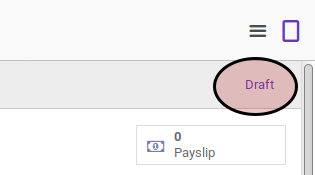
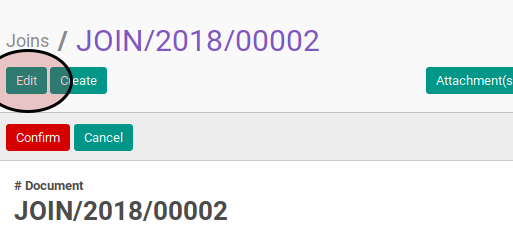
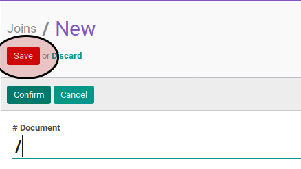

# Memodifikasi Payslip

## A. INPUT

* Data payslip yang akan dimodifikasi harus memiliki status **Draft**.

## B. LANGKAH KERJA

1. Buka menu **Human Resources -> Payroll -> Employee Payslip**. Abaikan jika sudah berada pada menu yang dimaksud.
2. Buka data payslip yang akan dimodifikasi. Abaikan jika data sudah dibuka.
3. Klik tombol **Edit** pada bagian atas-kiri form

4. Pilih dan sesuaikan **Employee** jika dibutuhkan. Harus diisi.
5. Pilih dan sesuaikan **Period Date Start** jika dibutuhkan. Harus diisi.
6. Pilih dan sesuaikan **Period Date End** jika dibutuhkan. Harus diisi.
7. Pilih dan sesuaikan **Payslip Type** jika dibutuhkan. Harus diisi.
8. Buka tab **Accounting Information**.
9. Isi dan sesuaikan **Force Move Date** jika dibutuhkan. Harus diisi.
10. Pilih dan sesuaikan **Salary Journal** jika dibutuhkan. Harus diisi.
11. Klik tombol dan sesuaikan **Import Timesheet Activity** pada bagian atas-kiri form.

12. Klik tombol **Compute Sheet** pada bagian atas-kiri form.

13. Klik tombol **Save** pada bagian atas-kiri form.

## C. OUTPUT

* Data paylip akan terbuat dengan status **Draft**.

