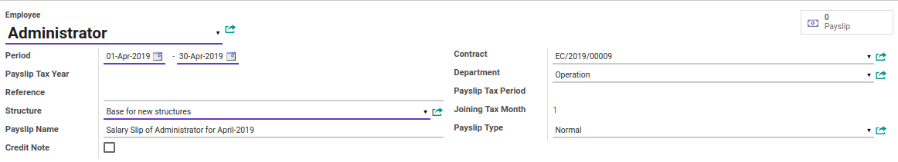
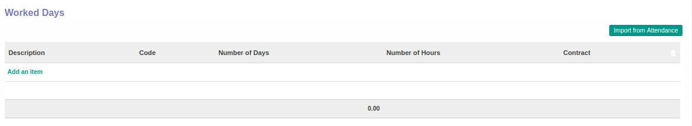
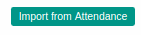
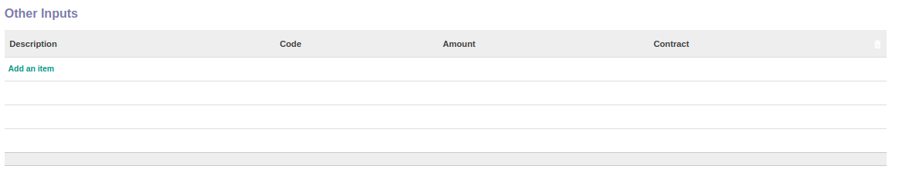
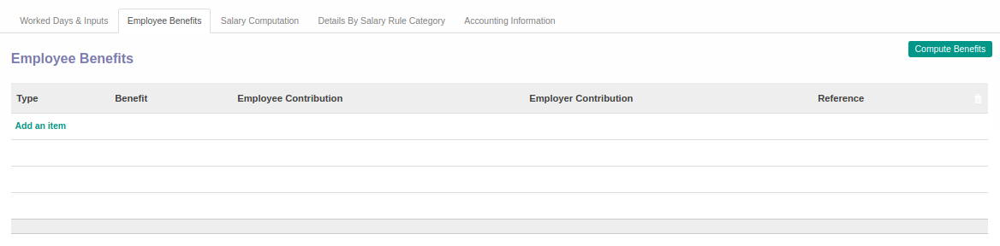
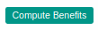
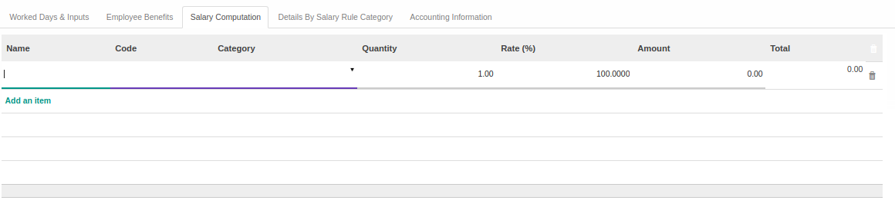
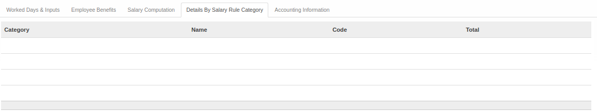
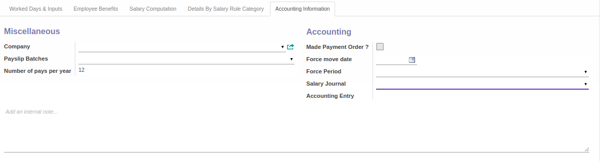

# Penjelasan Payslip

Informasi pada *Employee Payslip* dibagi menjadi beberapa area, diantaranya:

* [Header](#bagian-header)
* [Tab Worked Days & Input](#tab-worked-days)
* [Tab Employee Benefits](#tab-employee-benefits)
* [Tab Salary Computation](#tab-salary-computation)
* [Tab Detail By Salary Rule Category](#tab-detail-salary)
* [Tab Accounting Information](#tab-accounting-info)

### <a name="bagian-header">HEADER</a>

#### <a name="field-employee">Employee</a>

Mendefinisikan karyawan

#### <a name="field-period">Period</a>

Mendefinisikan rentang periode *Payslip*

#### <a name="field-payslip-tax-year">Payslip Tax Year</a>

#TODO

#### <a name="field-ref">Reference</a>

Nomor referensi terkait payslip

#### <a name="field-structure">Structure</a>

Mendefinisikan *Structure* yang akan digunakan

#### <a name="field-name">Payslip Name</a>

Nama *Payslip*

#### <a name="field-credit-note">Credit Note</a>

#TODO

#### <a name="field-contract">Contract</a>

Mendefinisikan contract karyawan

#### <a name="field-department">Department</a>

Mendefinisikan departemen tempat karyawan bekerja

#### <a name="field-payslip-tax-period">Payslip Tax Period</a>

#TODO

#### <a name="field-joining-tax-month">Joining Tax Month</a>

#TODO

#### <a name="field-payslip-type">Payslip Type</a>

Mendefinisikan tipe *Payslip*

### <a name="tab-worked-days">TAB WORKED DAYS & INPUT</a>

### <a name="worked-days">Worked Days</a>

#### <a name="field-import-from-attendance">Import From Attendance</a>

Tombol yang digunakan untuk mengimport data *Worked Days* dari *Attendance*

#### <a name="field-worked-days-description">Description</a>

Deskripsi/Penjelasan terkait data *Worked Days*

#### <a name="field-worked-days-code">Code</a>

Kode *Worked Days*

#### <a name="field-worked-days-number-days">Number of Days</a>

Jumlah hari bekerja

#### <a name="field-worked-days-number-hours">Number of Hours</a>

Jumlah jam bekerja

#### <a name="field-worked-days-contract">Contract</a>

Mendefinisikan kontrak karyawan

### <a name="other-inputs">Other Inputs</a>

#### <a name="field-other-inputs-description">Description</a>

Deskripsi/Penjelasan terkait data *Other Inputs*

#### <a name="field-other-inputs-code">Code</a>

Kode *Other Inputs*

#### <a name="field-other-inputs-amount">Amount</a>

Jumlah *Other Inputs* yang harus dibayarkan

#### <a name="field-other-inputs-contract">Contract</a>

Mendefinisikan kontrak karyawan

### <a name="tab-employee-benefits">TAB EMPLOYEE BENEFITS</a>

#### <a name="field-compute-benefits">Compute Benefits</a>

Tombol yang digunakan untuk melakukan perhitungan tunjangan karyawan

#### <a name="field-benefit-type">Type</a>

Mendefinisikan tipe tunjangan karyawan

#### <a name="field-benefit">Benefit</a>

Nama tunjangan yang akan diberikan kepada karyawan

#### <a name="field-employee-contribution">Employee Contribution</a>

#TODO

#### <a name="field-employeer-contribution">Employeer Contribution</a>

#TODO

#### <a name="field-benefits-reference">Reference</a>

Nomor referensi terkait tunjangan karyawan

### <a name="tab-salary-computation">TAB SALARY COMPUTATION</a>

#### <a name="field-salary-computation-name">Name</a>

Nama upah karyawan

#### <a name="field-salary-computation-code">Code</a>

Kode upah karyawan

#### <a name="field-salary-computation-categ">Category</a>

Kategori upah karyawan

#### <a name="field-salary-computation-qty">Quantity</a>

Mendefinisikan kuantitas upah karyawan

#### <a name="field-salary-computation-rate">Rate (%)</a>

Mendefinisikan rate upah karyawan

#### <a name="field-salary-computation-amount">Amount</a>

Mendefinisikan jumlah upah karyawan yang dibayarkan

#### <a name="field-salary-computation-total">Total</a>

Mendefinisikan total keseluruhan upah karyawan yang dibayarkan

### <a name="tab-detail-salary">TAB DETAIL BY SALARY RULE CATEGORY</a>

#### <a name="field-detail-salary-category">Category</a>

Mendefinisikan kategori *Salary Rule*

#### <a name="field-detail-salary-name">Name</a>

Nama kategori *Salary Rule*

#### <a name="field-detail-salary-code">Code</a>

Kode kategori *Salary Rule*

#### <a name="field-detail-salary-total">Total</a>

Jumlah total keseluruhan dari kategori *Salary Rule*

### <a name="tab-accounting-info">TAB ACCOUNTING INFORMATION</a>

### <a name="miscellaneous">Miscellaneous</a>

#### <a name="field-accounting-info-company">Company</a>

Mendefinisikan perusahaan tempat karyawan bekerja

#### <a name="field-accounting-info-payslip-batches">Payslip Batches</a>

#TODO

#### <a name="field-accounting-info-number-of-pay">Number of pays per year</a>

Menginformasikan seberapa banyak pembayaran akan dilakukan dalam setahun

### <a name="accounting">Accounting</a>

#### <a name="field-accounting-info-made-payment-order">Made Payment Order ?</a>

#TODO

#### <a name="field-accounting-info-force-move-date">Force move date</a>

#TODO

#### <a name="field-accounting-info-force-period">Force Period</a>

#TODO

#### <a name="field-accounting-info-salary-journal">Salary Journal</a>

Mendefinisikan jurnal *Salary* yang akan digunakan

#### <a name="field-accounting-info-accounting-entry">Accounting Entry</a>

#TODO

#### <a name="field-accounting-info-internal-note">Internal Note</a>

Catatan internal