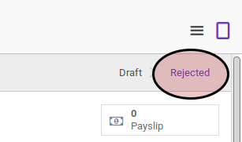
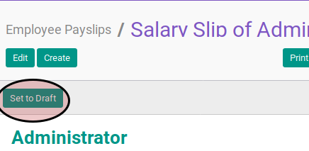

# Merestart Payslip

## A. INPUT

* Data payslip yang akan direstart harus memiliki status **Rejected**.

* User yang akan merestart harus memiliki akses untuk merestart payslip.

## B. LANGKAH KERJA

1. Buka menu **Human Resources -> Payroll -> Employee Payslip**. Abaikan jika sudah berada pada menu yang dimaksud.
2. Buka data payslip yang akan direstart. Abaikan jika data sudah dibuka.
3. Klik tombol **Confirm** pada bagian atas-kiri form.

## C. OUTPUT

* Data payslip akan berubah menjadi **Draft**.
