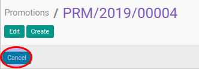

# Membatalkan Promotion Transition

## A. INPUT

* Data promotion transition yang akan dibatalkan harus memiliki status selain **Cancel**.

* User yang akan membatalkan harus memiliki akses untuk membatalkan promotion transition.

## B. INSTRUKSI KERJA

1. Buka menu **Human Resources -> Career Transition -> Promotions**. Abaikan jika sudah berada pada menu yang dimaksud.
2. Buka data promotion transition yang akan dibatalkan. Abaikan jika data sudah dibuka.
3. Klik tombol **Cancel** pada bagian atas-kiri form.

## C. OUTPUT

* Data promotion transition akan berubah menjadi **Cancel**.

