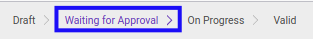

# Mengkonfirmasi Promotion Transition

## A. INPUT

* Data promotion transition yang akan dikonfirmasi harus memiliki status **Draft**.

* User yang akan mengkonfirmasi harus memiliki akses untuk mengkonfirmasi promotion transition.

## B. INSTRUKSI KERJA

1. Buka menu **Human Resources -> Career Transition -> Promotions**. Abaikan jika sudah berada pada menu yang dimaksud.
2. Buka data promotion transition yang akan dikonfirmasi. Abaikan jika data sudah dibuka.
3. Klik tombol **Confirm** pada bagian atas-kiri form.

## C. OUTPUT

* Data promotion transition akan berubah menjadi **Waiting for Approval**.

* Data promotion transition sudah tidak bisa dimodifikasi.
