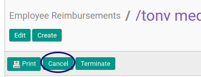
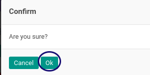

# Membatalkan Reimbursement

## A. INPUT

* Data *Reimbursement* yang akan dikonfirmasi harus memiliki status **Draft** atau **Waiting For Approval**.

* User yang akan mengkonfirmasi harus memiliki akses untuk **[Membatalkan Document](./penjelasan.md#field-can-cancel)** reimbursement.

## B. INSTRUKSI KERJA

1. Buka menu **Human Resources -> Reimbursement -> Reimbursement**. Abaikan jika sudah berada pada menu yang dimaksud.
2. Buka data reimbursement yang akan dibatalkan. Abaikan jika data sudah dibuka.
3. Klik tombol **Cancel** pada bagian atas-kiri form.

4. Pilih **[Reason](./penjelasan.md#field-cancel-reason)**. Harus disi.
5. Klik tombol **Confirm** pada bagian bawah kiri form.

6. Klik tombol **OK** pada bagian bawah kiri form.

## C. OUTPUT

* Data reimbursement akan berubah menjadi **Cancel**.

* Data **[Cancel](./penjelasan.md#field-log-cancel)** pada log reimbursement akan berisi nama user dan tanggal saat pembatalan.
