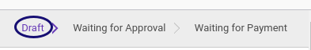

# Membuat Reimbursement

## A. INPUT

*(Tidak ada prasyarat khusus)*

## B. INSTRUKSI KERJA

1. Buka menu **Human Resources -> Reimbursement -> Reimbursement**. Abaikan jika sudah berada pada menu yang dimaksud.
2. Klik tombol **Create** pada bagian atas-kiri form.

3. Isi dan sesuaikan **[# Document](./penjelasan.md#field-document)** jika dibutuhkan. Harus diisi.
4. Pilih **[Employee](./penjelasan.md#field-employee)**. Harus diisi.
5. Pilih **[Department](./penjelasan.md#field-department)**. Tidak Harus diisi.
6. Pilih **[Manager](./penjelasan.md#field-manager)**. Tidak Harus diisi.
7. Pilih **[Job Position](./penjelasan.md#field-job-position)**. Tidak Harus diisi.
8. Isi **[Date Expense](./penjelasan.md#field-date-expense)**. Harus diisi.
9. Isi **[Date Due](./penjelasan.md#field-date-due)**. Harus diisi.
10. Pilih **[Type](./penjelasan.md#field-type)**. Harus diisi.
11. Pilih **[Currency](./penjelasan.md#field-currency)**. Harus diisi.
12. Buka Tab **[Reimbursement Detail](./penjelasan.md#tab-detail)**.
13. <a name="l13">[Tambah](./membuat-detail.md)/[Modifikasi](./modifikasi-detail.md)/[Hapus](./menghapus-detail.md)</a> [**Reimbursement Detail**](./penjelasan.md#tab-detail). Lakukan sampai dengan anda selesai memasukkan semua **detail reimbursement** yang dibutuhkan.
14. Buka Tab **[Accounting Info](./penjelasan.md#tab-accounting)**.
15. Pilih dan sesuaikan **[Journal](./penjelasan.md#field-journal)** jika dibutuhkan. Harus diisi.
16. Pilih dan sesuaikan **[Reimbursement Payable Account](./penjelasan.md#field-payable-account)** jika dibutuhkan. Harus diisi.
17. Buka Tab **[Note](./penjelasan.md#tab-note)**.
18. Isi **[Note](./penjelasan.md#field-tab-note-note)**. Tidak harus diisi.
19. Klik tombol **Save** pada bagian atas-kiri form.

## C. OUTPUT

* Data Reimbursement akan tersimpan dengan status **Draft**.

