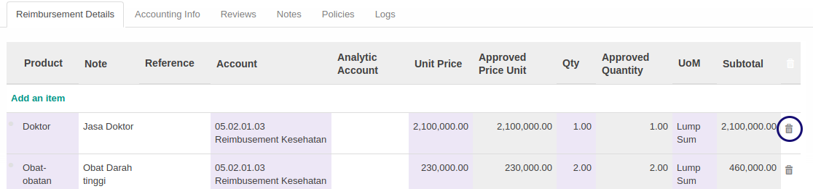

# Menghapus Detail Reimbursement

*(Instruksi kerja ini merupakan sub instruksi dari (1) [Membuat Reimbursement](./membuat.md), atau (2) [Memodifikasi Reimbursement](./modifikasi.md). Instruksi kerja ini tidak bisa berdiri sendiri)*

## A. INPUT

* Data **Reimbursement** harus memiliki status **Draft**.

## B. INSTRUKSI KERJA

1. <a name="l1">Double Klik</a> gambar **tong sampah** pada tabel [**Reimbursement Detail**](./penjelasan.md#tab-detail) pada data yang akan dihapus.

2. Ulangi [langkah ke-1](#l1) untuk setiap detail reimbursement yang akan dihapus.
3. Lanjutkan [langkah ke-13 instruksi Membuat Reimbursement](./membuat.md#l13) atau [langkah ke-14 instruksi Memodifikasi Reimbursement](./modifikasi.md#l14).

## C. OUTPUT

*(Tidak ada instruksi khusus)*
