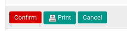

# Mengkonfirmasi Reimbursement

## A. INPUT

* Data *Reimbursement* yang akan dikonfirmasi harus memiliki status **Draft**.

* User yang akan mengkonfirmasi harus memiliki akses untuk **[Mengkonfirmasi Document](./penjelasan.md#field-can-confirm)** reimbursement.

## B. INSTRUKSI KERJA

1. Buka menu **Human Resources -> Reimbursement -> Reimbursement**. Abaikan jika sudah berada pada menu yang dimaksud.
2. Buka data reimbursement yang akan dikonfirmasi. Abaikan jika data sudah dibuka.
3. Klik tombol **Confirm** pada bagian atas-kiri form.

## C. OUTPUT

* Data reimbursement akan berubah menjadi **Waiting for Approval**.

* Data reimbursement sudah tidak bisa dimodifikasi atau dihapus.
* Data **[Confirmation](./penjelasan.md#field-log-confirmation)** pada log reimbursement akan berisi nama user dan tanggal saat konfirmasi.
