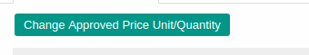
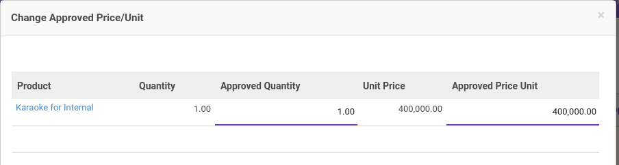
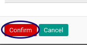

# Mengubah Nilai Reimbursement

## A. INPUT

* Data *Reimbursement* yang akan dirubah nilai reimbursementnya harus memiliki status **Waiting For Approval**.

* User yang akan merubah nilai reimbursement harus memiliki akses untuk **[Merubah detail Document](./penjelasan.md#field-can-change-detail)** reimbursement.

## B. INSTRUKSI KERJA

1. Buka menu **Human Resources -> Reimbursement -> Reimbursement**. Abaikan jika sudah berada pada menu yang dimaksud.
2. Buka data reimbursement yang nilainya akan diubah. Abaikan jika data sudah dibuka.
3. Klik tombol **Change Approved Price/Quantity** pada bagian atas-kiri detail reimbursement.

4. Form Change Approved Price/Unit akan muncul

5. Ubah **[Approved Quantity](./penjelasan.md#field-approve-qty)** jika diperlukan.
6. Ubah **[Approved Price Unit](./penjelasan.md#field-approve-price)** jika diperlukan.
7. Klik tombol **Confirmed** pada bagian kiri bawah.

## C. OUTPUT

* Nilai Approved Quantity dan Nilai Approved Price Unit akan berubah sesuai dengan perubahan yang dilakukan.

## Chapter
- [Transaksi](../../transaksi.md)
- [Penjelasan Reimbursement](./penjelasan.md)
- [Membuat Reimbursement](./membuat.md)
- [Modifikasi Reimbursement](./modifikasi.md)
- [Menghapus Reimbursement](./menghapus.md)
- [Menambah Detail Reimbursement](./membuat-detail.md)
- [Modifikasi Detail Reimbursement](./modifikasi-detail.md)
- [Menghapus Detail Reimbursement](./menghapus-detail.md)
- [Mengkonfirmasi Reimbursement](./mengkonfirmasi.md)
- [Menyetujui Reimbursement](./menyetujui.md)
- [Menolak Reimbursement](./menolak.md)
- [Merestart Persetujuan Reimbursement](./merestart-persetujuan.md)
- [Membatalkan Reimbursement](./membatalkan.md)
- [Merestart Reimbursement](./merestart.md)
- [Terminate Reimbursement](./terminate.md)
