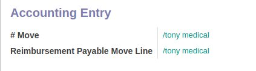

# Menyetujui Reimbursement

## A. INPUT

* Data *Reimbursement* yang akan dikonfirmasi harus memiliki status **Waiting For Approval**.

* User yang akan mengkonfirmasi harus memiliki akses untuk **[Menyetujui Document](./penjelasan.md#tab-reviews)** reimbursement.

## B. INSTRUKSI KERJA

1. Buka menu **Human Resources -> Reimbursement -> Reimbursement**. Abaikan jika sudah berada pada menu yang dimaksud.
2. Buka data reimbursement yang akan dikonfirmasi. Abaikan jika data sudah dibuka.
3. Klik tombol **Validation** pada bagian atas-kiri form.

## C. OUTPUT

* Data reimbursement akan berubah menjadi **Waiting for Payment** jika semua user yang harus memvalidasi sudah melakukan proses validasi.

* Data Accounting Entry (**[# Move](./penjelasan.md#field-move)** dan **[Reimbursement Payable Move Line](./penjelasan.md#field-move-line)** akan berubah terisi otomatis jika semua user yang harus memvalidasi sudah melakukan proses validasi.

* Data **[Validation](./penjelasan.md#tab-reviews)** pada tab review akan berisi nama user dan tanggal saat menyetujui.
* Data **[Approval](./penjelasan.md#field-log-approval)** pada log reimbursement akan berisi nama user dan tanggal saat melakukan approval.
