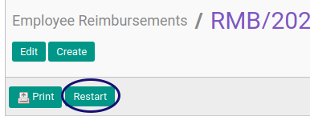
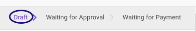

# Merestart Reimbursement

## A. INPUT

* Data *Reimbursement* yang akan direstart harus memiliki status **Cancel**.

* User yang akan merestart harus memiliki akses untuk **[Merestart Document](./penjelasan.md#field-can-restart)** reimbursement.

## B. INSTRUKSI KERJA

1. Buka menu **Human Resources -> Reimbursement -> Reimbursement**. Abaikan jika sudah berada pada menu yang dimaksud.
2. Buka data reimbursement yang akan direstart. Abaikan jika data sudah dibuka.
3. Klik tombol **Restart** pada bagian atas-kiri form.

5. Klik tombol **OK** pada bagian bawah kiri form.

## C. OUTPUT

* Data reimbursement akan berubah menjadi **Draft**.

## Chapter
- [Transaksi](../../transaksi.md)
- [Penjelasan Reimbursement](./penjelasan.md)
- [Membuat Reimbursement](./membuat.md)
- [Modifikasi Reimbursement](./modifikasi.md)
- [Menghapus Reimbursement](./menghapus.md)
- [Menambah Detail Reimbursement](./membuat-detail.md)
- [Modifikasi Detail Reimbursement](./modifikasi-detail.md)
- [Menghapus Detail Reimbursement](./menghapus-detail.md)
- [Mengkonfirmasi Reimbursement](./mengkonfirmasi.md)
- [Menyetujui Reimbursement](./menyetujui.md)
- [Menolak Reimbursement](./menolak.md)
- [Merestart Persetujuan Reimbursement](./merestart-persetujuan.md)
- [Mengubah Nilai Reimbursement](./mengubah-nilai-reimbursement.md)
- [Membatalkan Reimbursement](./membatalkan.md)
- [Terminate Reimbursement](./terminate.md)
