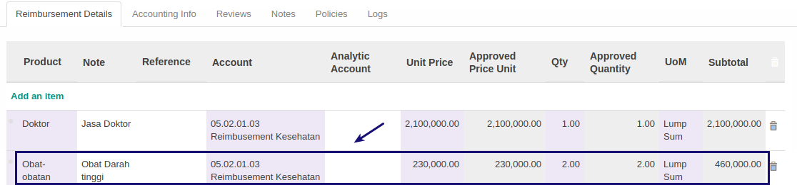

# Modifikasi Detail Reimbursement

*(Instruksi kerja ini merupakan sub instruksi dari (1) [Membuat Reimbursement](./membuat.md), atau (2) [Memodifikasi Reimbursement](./modifikasi.md). Instruksi kerja ini tidak bisa berdiri sendiri)*

## A. INPUT

*(Tidak ada instruksi khusus)*

## B. INSTRUKSI KERJA

1. <a name="l1">Double Klik</a> data **detail reimbursement** pada tabel [**Reimbursement Detail**](./penjelasan.md#tab-detail).

2. Ubah **[Product](./penjelasan.md#field-product)** jika diperlukan. Harus diisi.
3. Ubah **[Note](./penjelasan.md#field-note)** jika diperlukan. Tidak Harus diisi.
4. Ubah **[Reference](./penjelasan.md#field-reference)** jika diperlukan. Tidak Harus diisi.
5. Ubah **[Account](./penjelasan.md#field-account)** jika diperlukan. Harus diisi.
6. Ubah **[Account Analytic](./penjelasan.md#field-analytic-account)** jika diperlukan. Tidak harus diisi.
7. Ubah **[Unit Price](./penjelasan.md#field-unit-price)** jika diperlukan. Harus diisi.
8. Ubah **[Qty](./penjelasan.md#field-qty)** jika diperlukan. Tidak Harus diisi.
9. Ubah **[UoM](./penjelasan.md#field-uom)** jika diperlukan. Harus diisi.
10. Ulangi [langkah ke-1](#l1) untuk setiap detail reimbursement yang akan dimodifikasi.
11. Lanjutkan [langkah ke-13 instruksi Membuat Reimbursement](./membuat.md#l13) atau [langkah ke-14 instruksi Memodifikasi Reimbursement](./modifikasi.md#l14).

## C. OUTPUT

*(Tidak ada instruksi khusus)*

## Chapter
- [Transaksi](../../transaksi.md)
- [Penjelasan Reimbursement](./penjelasan.md)
- [Membuat Reimbursement](./membuat.md)
- [Modifikasi Reimbursement](./modifikasi.md)
- [Menghapus Reimbursement](./menghapus.md)
- [Menambah Detail Reimbursement](./membuat-detail.md)
- [Menghapus Detail Reimbursement](./menghapus-detail.md)
- [Mengkonfirmasi Reimbursement](./mengkonfirmasi.md)
- [Menyetujui Reimbursement](./menyetujui.md)
- [Menolak Reimbursement](./menolak.md)
- [Merestart Persetujuan Reimbursement](./merestart-persetujuan.md)
- [Mengubah Nilai Reimbursement](./mengubah-nilai-reimbursement.md)
- [Membatalkan Reimbursement](./membatalkan.md)
- [Merestart Reimbursement](./merestart.md)
- [Terminate Reimbursement](./terminate.md)
