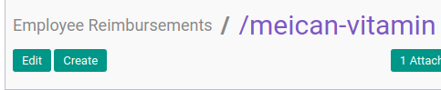

# Modifikasi Reimbursement

## A. INPUT

* Data **Reimbursement** yang akan dimodifikasi harus memiliki status **Draft**.

## B. INSTRUKSI KERJA

1. Buka menu **Human Resources -> Reimbursement -> Reimbursement**. Abaikan jika sudah berada pada menu yang dimaksud.
2. Buka data *Reimbursement* yang akan dimodifikasi. Abaikan jika data sudah dibuka.
3. Klik tombol **Edit** pada bagian atas-kiri form.

4. Ubah dan sesuaikan **[# Document](./penjelasan.md#field-document)** jika dibutuhkan. Harus diisi.
5. Ubah **[Employee](./penjelasan.md#field-employee)** jika dibutuhkan. Harus diisi.
6. Ubah **[Department](./penjelasan.md#field-department)** jika dibutuhkan. Tidak Harus diisi.
7. Ubah **[Manager](./penjelasan.md#field-manager)** jika dibutuhkan. Tidak Harus diisi.
8. Ubah **[Job Position](./penjelasan.md#field-job-position)** jika dibutuhkan. Tidak Harus diisi.
9. Ubah **[Date Expense](./penjelasan.md#field-date-expense)** jika dibutuhkan. Harus diisi.
10. Ubah **[Date Due](./penjelasan.md#field-date-due)** jika dibutuhkan. Harus diisi.
11. Ubah **[Type](./penjelasan.md#field-type)** jika dibutuhkan. Harus diisi.
12. Ubah **[Currency](./penjelasan.md#field-currency)** jika dibutuhkan. Harus diisi.
13. Buka Tab **[Reimbursement Detail](./penjelasan.md#tab-detail)**.
14. <a name="l14">[Tambah](./membuat-detail.md)/[Modifikasi](./modifikasi-detail.md)/[Hapus](./menghapus-detail.md)</a> [**Reimbursement Detail**](./penjelasan.md#tab-detail). Lakukan sampai dengan anda selesai memasukkan semua **detail reimbursement** yang dibutuhkan.
15. Buka Tab **[Accounting Info](./penjelasan.md#tab-accounting)**.
16. Ubah dan sesuaikan **[Journal](./penjelasan.md#field-journal)** jika dibutuhkan. Harus diisi.
17. Ubah dan sesuaikan **[Reimbursement Payable Account](./penjelasan.md#field-payable-account)** jika dibutuhkan. Harus diisi.
18. Buka Tab **[Note](./penjelasan.md#tab-note)**.
19. Ubah **[Note](./penjelasan.md#field-tab-note-note)** jika dibutuhkan. Tidak harus diisi.
20. Klik tombol **Save** pada bagian atas-kiri form.

## C. OUTPUT

* Data Reimbursement akan tersimpan dengan status **Draft** sesuai perubahan.

## Chapter
- [Transaksi](../../transaksi.md)
- [Penjelasan Reimbursement](./penjelasan.md)
- [Membuat Reimbursement](./membuat.md)
- [Menghapus Reimbursement](./menghapus.md)
- [Menambah Detail Reimbursement](./membuat-detail.md)
- [Modifikasi Detail Reimbursement](./modifikasi-detail.md)
- [Menghapus Detail Reimbursement](./menghapus-detail.md)
- [Mengkonfirmasi Reimbursement](./mengkonfirmasi.md)
- [Menyetujui Reimbursement](./menyetujui.md)
- [Menolak Reimbursement](./menolak.md)
- [Merestart Persetujuan Reimbursement](./merestart-persetujuan.md)
- [Mengubah Nilai Reimbursement](./mengubah-nilai-reimbursement.md)
- [Membatalkan Reimbursement](./membatalkan.md)
- [Merestart Reimbursement](./merestart.md)
- [Terminate Reimbursement](./terminate.md)
