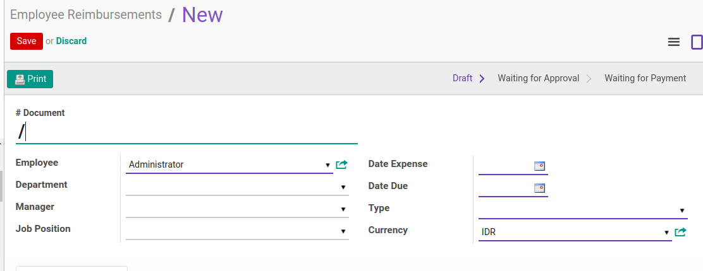
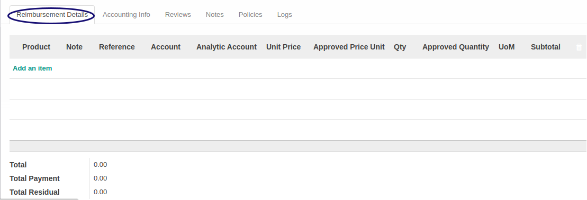
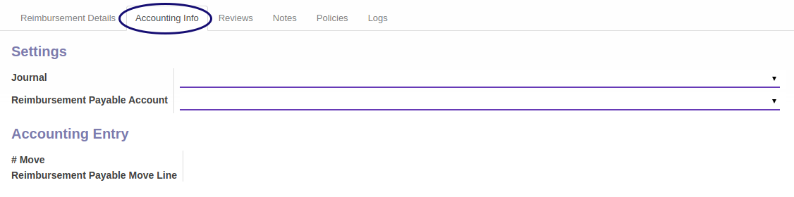
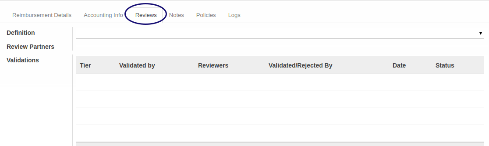
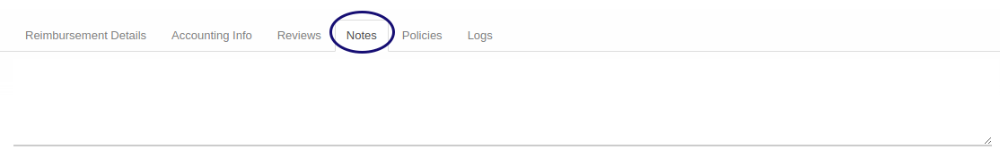
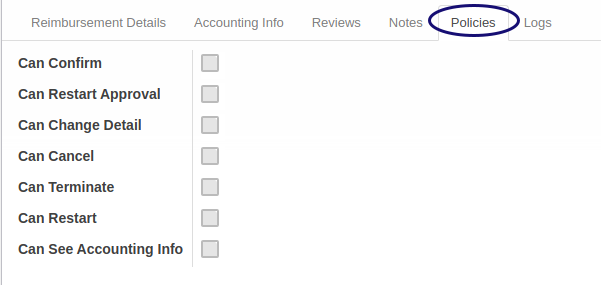
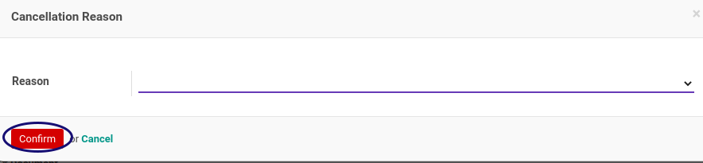

# Penjelasan Reimbursement

Informasi pada **Reimbursement**  dibagi menjadi beberapa area, diantaranya:
* [Header](#bagian-header)
* [Tab Reimbursement Detail](#tab-detail)
* [Tab Accounting Info](#tab-accounting)
* [Tab Reviews](#tab-reviews)
* [Tab Note](#tab-note)
* [Tab Policies](#tab-policy)
* [Tab Logs](#tab-log)

Form lainnya yang muncul pada proses reimbursement
* [Form Pembatalan](#form-batal)
* [Form Terminate](#form-terminate)

### <a name="bagian-header">HEADER</a>

#### <a name="field-document"># Document</a>

Nomor dokumen.

#### <a name="field-employee">Employee</a>

Karyawan.

#### <a name="field-department">Department</a>

Departemen. Akan terisi otomatis sesuai isian pada data master karyawan/*Employee*

#### <a name="field-manager">Manager</a>

Nama Manajer. Akan terisi otomatis sesuai isian pada data master karyawan/*Employee*

#### <a name="field-job-position">Job Position</a>

Nama Posisi pekerjaan. Akan terisi otomatis sesuai isian pada data master karyawan/*Employee*

#### <a name="field-date-expense">Date Expense</a>

Tanggal reimbursement.

#### <a name="field-date-due">Date Due</a>

Tanggal berakhir/**due** dari reimbursement.

#### <a name="field-type">Type</a>

Jenis reimbursement. Pilihan merupakan isian dari tabel **type reimbursement**.

#### <a name="field-currency">Currency</a>

Mata Uang. Pilihan merupakan isian dari tabel **currency**.

### <a name="tab-detail">Tab Reimbursement Detail</a>

#### <a name="field-product">Product</a>

Nama Produk yang akan direimburse. Pilihan merupakan isian dari tabel **product** yang diperbolehkan pada jenis reimbursement.

#### <a name="field-note">Note</a>

Definisikan catatan tentang produk yang lebih detail.

#### <a name="field-reference">Reference</a>

Definisikan referensi.

#### <a name="field-account">Account</a>

Nama kode akun dari Produk yang akan direimburse. Secara default isian akan sesuai dengan isian *Account* dari tabel **Product**. Pilihan merupakan isian dari tabel **account**.

#### <a name="field-analytic-account">Analytic Account</a>

Nama akun analitik dari Produk yang akan direimburse. Pilihan merupakan isian dari tabel **analytic account**.

#### <a name="field-unit-price">Unit Price</a>

Definisikan harga produk yang akan direimburse.

#### <a name="field-approve-price">Aprroved Price Unit</a>

Definisikan harga yang disetujui dari produk yang direimburse. Hanya diisi oleh user yang bisa menyetujui/**approve**. Secara default isian akan sama dengan Unit price.

#### <a name="field-qty">Qty</a>

Definisikan jumlah/*quantity* produk yang akan direimburse.

#### <a name="field-approve-qty">Aprroved Quantity</a>

Definisikan jumlah yang disetujui dari produk yang direimburse. Hanya diisi oleh user yang bisa menyetujui/**approve**. Secara defaut isian akan sama dengan Qty.

#### <a name="field-uom">UoM</a>

Definisikan satuan/Unit of Measurement dari produk yang direimburse. Secara default isian akan sesuai dengan isian *UoM* dari tabel **Product**. Pilihan merupakan isian dari tabel **UoM**.

#### <a name="field-sub-total">Sub Total</a>

Subtotal merupakan perkalian antara qty dan harga.

#### <a name="field-total">Total</a>

Total merupakan dari jumlah total reimbursement yang harus dibayarkan. Akan terhitung secara otomatis.

#### <a name="field-total-payment">Total Payment</a>

Total Payment merupakan total dari reimbursement yang sudah dibayarkan. Akan terhitung secara otomatis.

#### <a name="field-total-residu">Total Residual</a>

Total Residual merupakan selisih total dari reimbursement dengan yang sudah dibayarkan. Akan terhitung secara otomatis.

### <a name="tab-accounting">Tab Accounting Info</a>

#### <a name="field-journal">Journal</a>

Nama Jurnal dari reimbursement. Secara default isian akan sesuai dengan isian *Journal* dari tabel **Reimbursement Type**. Pilihan merupakan isian dari tabel **journal**.

#### <a name="field-payable-account">Reimbursement Payable Account</a>

Nama Akun Payable dari reimbursement. Secara default isian akan sesuai dengan isian *Payable Account* dari tabel **Reimbursement Type**. Pilihan merupakan isian dari tabel **account**.

#### <a name="field-move"># Move</a>

Nomor move merupakan Nomor dokumen dari jurnal entry.

#### <a name="field-move-line">Reimbursement Payable Move Line</a>

Nomor transaksi payable move line merupakan Nomor dokumen dari jurnal item pada jurnal entry.

### <a name="tab-reviews">Tab Reviews</a>

#### <a name="field-definition">Definition</a>

Definisi dari proses multiple approval yang dibuat pada konfigurasi **multiple approval** untuk proses reimbursement. Secara default akan terisi otomatis sesuai dengan keadaan reimbursement.

#### <a name="field-review-validation">Review Partner Validation</a>

Daftar User yang berhak melakukan validasi sesuai definisi yang ditetapkan. Terisi otomatis dari tabel **multiple approval**.

### <a name="tab-note">Tab Note</a>

#### <a name="field-tab-note-note">Note</a>

Catatan lebih detail mengenai reimbursement.

### <a name="tab-policy">Tab Policies</a>

#### <a name="field-can-confirm">Can Confirm</a>

Identifikasi apakah user berhak melakukan proses confirmasi.

#### <a name="field-can-restart-approval">Can Restart Approval</a>

Identifikasi apakah user berhak melakukan proses restart persetujuan.

#### <a name="field-can-change-detail">Can Change Detail</a>

Identifikasi apakah user berhak melakukan perubahan isi detail.

#### <a name="field-can-cancel">Can Cancel</a>

Identifikasi apakah user berhak melakukan pembatalan reimbursement.

#### <a name="field-can-terminate">Can Terminate</a>

Identifikasi apakah user berhak melakukan proses terminasi reimbursement.

#### <a name="field-can-restart">Can Restart</a>

Identifikasi apakah user berhak melakukan proses restart reimbursement.

#### <a name="field-can-see">Can See Accounting Info</a>

Identifikasi apakah user berhak melihat informati accounting.

### <a name="tab-log">Tab Logs</a>

Tab Log berisikan informasi log mengenai nama dan tanggal proses

#### <a name="field-log-confirmation">Confirmation</a>

Informasi mengenai nama dan kapan proses konfirmasi dilakukan.

#### <a name="field-log-approval">Approval</a>

Informasi mengenai nama dan kapan proses persetujuan dilakukan.

#### <a name="field-log-finish">Finish</a>

Informasi mengenai nama dan kapan proses persetujuan dilakukan.

#### <a name="field-log-cancel">Cancellation</a>

Informasi mengenai nama dan kapan proses pembatalan dilakukan.

#### <a name="field-log-terminate">Termination</a>

Informasi mengenai nama dan kapan proses terminasi dilakukan.

### <a name="form-batal">Form Pembatalan</a>

Form ini muncul saat transaksi pembatalan/cancel dilakukan

#### <a name="field-cancel-reason">Reason</a>

Definisikan alasan pembatalan

### <a name="form-terminate">Form Terminate</a>

Form ini muncul saat proses terminate dilakukan

#### <a name="field-terminate-reason">Reason</a>

Definisikan alasan terminate
