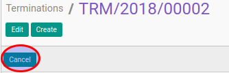

# Membatalkan Termination Transition

## A. INPUT

* Data termination transition yang akan dibatalkan harus memiliki status selain **Cancel**.

* User yang akan membatalkan harus memiliki akses untuk membatalkan termination transition.

## B. INSTRUKSI KERJA

1. Buka menu **Human Resources -> Career Transition -> Terminations**. Abaikan jika sudah berada pada menu yang dimaksud.
2. Buka data termination transition yang akan dibatalkan. Abaikan jika data sudah dibuka.
3. Klik tombol **Cancel** pada bagian atas-kiri form.

## C. OUTPUT

* Data termination transition akan berubah menjadi **Cancel**.

