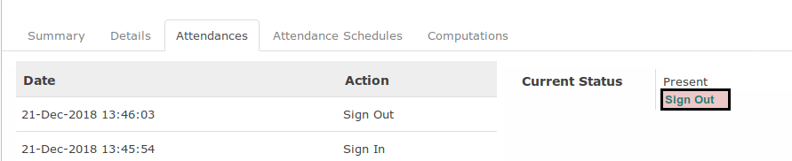
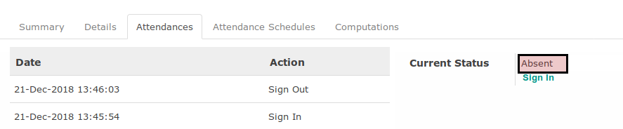

# Absen Keluar

## A. INPUT

* Absen keluar hanya dapat dilakukan pada data timesheet aktif

## B. INSTRUKSI KERJA

1. Klik menu **Human Resource -> Time Tracking -> My Current Timesheets**. Abaikan jika sudah berada pada menu yang dimaksud.
2. Buka tab **Attendances**.
3. Klik label **Sign-Out**

## C. OUTPUT

* Status absensi karyawan akan berubah menjadi **Absent**

