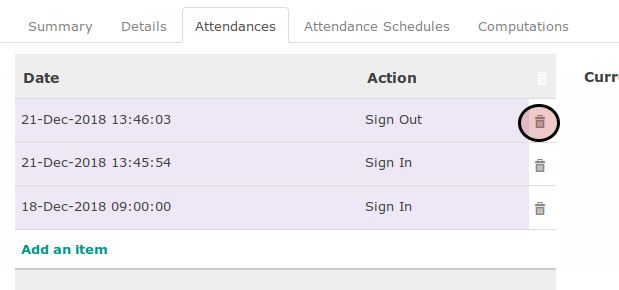

# Menghapus Absen

## A. INPUT

* Data timesheet yang akan dihapus absennya harus memiliki status **Open**.

## B. INSTRUKSI KERJA

1. Klik menu **Human Resource -> Time Tracking -> Timesheets** atau **Human Resource -> Time Tracking -> My Timesheets**. Abaikan jika sudah berada pada menu yang dimaksud.
2. Buka data timesheet yang akan dihapus absennya. Abaikan jika data sudah dibuka.
3. Klik tombol **Edit** pada bagian atas-kiri form.

4. Buka tab **Attendances**.
5. <a name="l5">Klik</a> icon tempat sampah pada bagian kanan data absen yang akan dihapus

6. Ulangi [langkah ke-5](#l5) untuk semua data absen yang akan dihapus.
7. Klik tombol **Save** pada bagian atas-kiri form.

## C. OUTPUT

*(Tidak ada instruksi khusus)*
