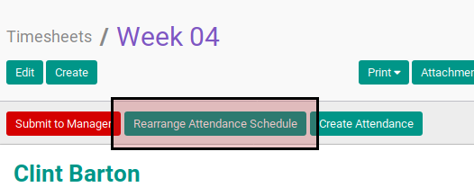

# Menghapus Attendance Schedule

## A. INPUT

* Data timesheet yang akan dihapus attendance schedule-nya harus memiliki status **Open**.

## B. INSTRUKSI KERJA

1. Klik menu **Human Resource -> Time Tracking -> Timesheets**. Abaikan jika sudah berada pada menu yang dimaksud.
2. Buka data timesheet yang akan dihapus attendance schedule-nya .Abaikan jika data sudah dibuka.
3. Klik tombol **Rearrange Attendance Schedule** pada bagian atas-kiri form. Calendar **Rearrange Attandance Schedule** akan terbuka.

4. Klik tombol **tree view toogle** pada bagian atas-kanan.

5. Buka data attendance schedule yang akan dihapus.
6. Klik tombol **More** pada bagian atas-tengah form.

7. Klik tombol **Delete** yang keluar pada drop-down tombol **More**

8. Klik tombol **Ok** pada dialog konfirmasi penghapusan yang muncul.

## C. OUTPUT

*(Tidak ada instruksi khusus)*
