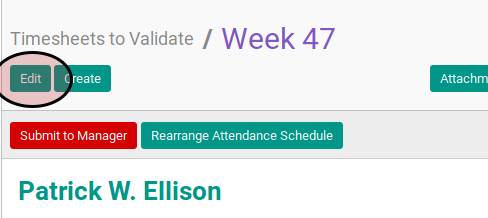
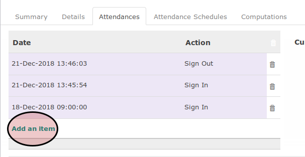

# Input Manual Absen

## A. INPUT

* Data timesheet yang akan diinput absennya harus memiliki status **Open**.

## B. INSTRUKSI KERJA

1. Klik menu **Human Resource -> Time Tracking -> Timesheets** atau **Human Resource -> Time Tracking -> My Timesheets**. Abaikan jika sudah berada pada menu yang dimaksud.
2. Buka data timesheet yang akan diinput absennya. Abaikan jika data sudah dibuka.
3. Klik tombol **Edit** pada bagian atas-kiri form.

4. Buka tab **Attendances**.
5. Klik labl **Add an Item** pada bagian bawah tabel **Attendance**.

7. <a name="l7">Isi</a> **Date**. Harus diisi.
8. Pilih **Action**. Harus diisi.
9. Ulangi [langkah ke-7](#l7) untuk semua data absen yang akan diinput.
10. Klik tombol **Save** pada bagian atas-kiri form.

## C. OUTPUT

*(Tidak ada instruksi khusus)*
