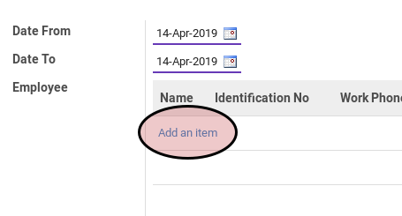
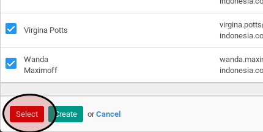

# Membuat Timesheet Secara Massal

## A. INPUT

*(Tidak ada prasyarat khusus)*

## B. INSTRUKSI KERJA

1. Klik menu **Human Resource -> Time Tracking -> Generate Timesheet**. Pop-up **Generate Timesheet** akan muncul.
2. Isi **Date Start**.
3. Isi **Date End**.
4. Klik tombol **Add an Item** pada tabel **Employee**.

5. Pilih karyawan yang akan dibuatkan timesheetnya.
6. Klik tombol **Select** pada bagian bawah-kiri.

7. Ulangi langkah ke-5 sampai semua karyawan yang akan dibuat timesheetnya sudah terpilih.
8. Klik tombol **Generate** pada bagian bawah-kiri.

## C. OUTPUT

* Timesheet akan terbuat dengan status **Open** untuk semua karyawan yang diplih.

