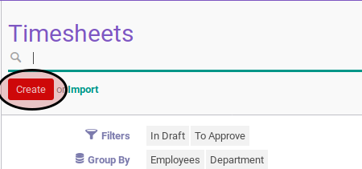
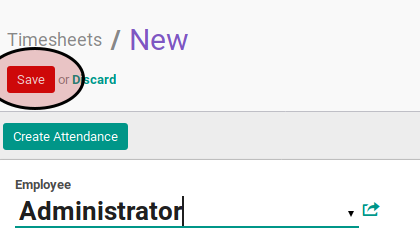

# Membuat Timesheet

## A. INPUT

*(Tidak ada prasyarat khusus)*

## B. INSTRUKSI KERJA

1. Klik menu **Human Resource -> Time Tracking -> Timesheets**. Abaikan jika sudah berada pada menu yang dimaksud.
2. Klik tombol **Create** pada bagian atas-kiri.

3. Pilih **[Employee](./penjelasan.md#field-employee)**. Harus diisi.
4. Isi **[Start Date](./penjelasan.md#field-timesheet-period)**. Harus diisi.
5. Isi **[End Date](./penjelasan.md#field-timesheet-period)**. Harus diisi.
6. Klik tombol **Save** pada bagian atas-kiri form.

## C. OUTPUT

*(Tidak ada output khusus)*
