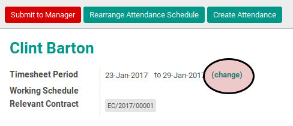
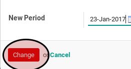

# Merubah Durasi Timesheet

## A. INPUT

* Data timesheet yang akan diubah durasinya harus memiliki status **Open**.

## B. INSTRUKSI KERJA

1. Klik menu **Human Resource -> Time Tracking -> Timesheets**. Abaikan jika sudah berada pada menu yang dimaksud.
2. Buka data timesheet yang akan diubah durasinya. Abaikan jika data sudah dibuka.
3. Klik label **Change** disebelah kanan durasi timesheet. Pop-up **Change Period** akan muncul.

4. Isi **Start Date**. Harus diisi.
5. Isi **End Date**. Harus diisi.
6. Klik tombol **Change** pada bagian bawah-kiri pop-up **Change Period**.

## C. OUPUT

* **Start Date** dan **End Date** timesheet akan berubah.
