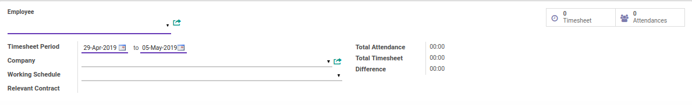
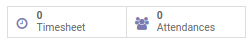
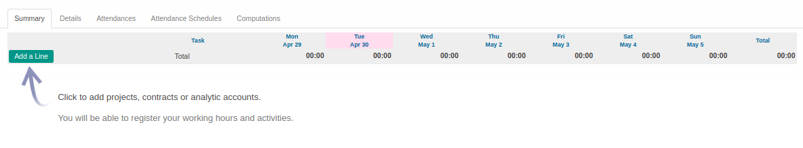
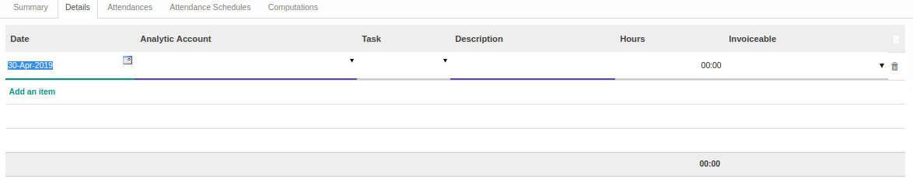
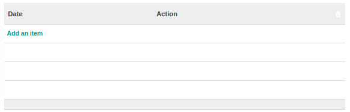
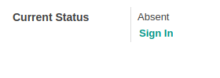
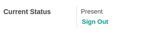
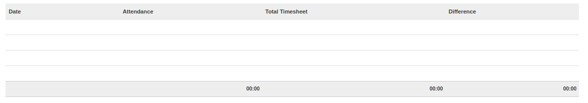
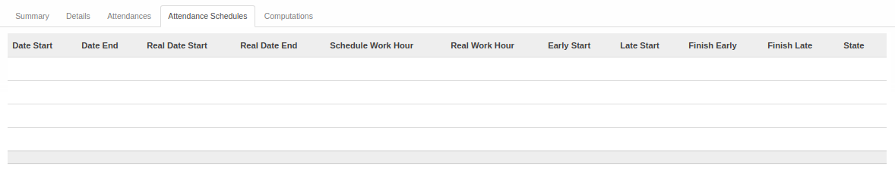
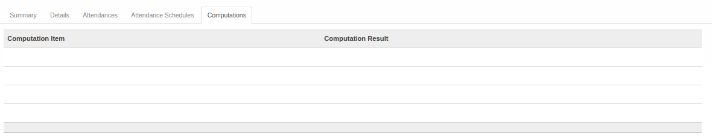

# Penjelasan Timesheet

Informasi pada Timesheet dibagi menjadi beberapa area, diantaranya:
* [Header](#bagian-header)
* [Tab Summary](#tab-summary)
* [Tab Details](#tab-details)
* [Tab Attendances](#tab-attendances)
* [Tab Attendances Schedules](#tab-attendances-schedules)
* [Tab Computations](#tab-computations)

### <a name="bagian-header">HEADER</a>

#### <a name="field-smart-button">Smart Button</a>

 

Tombol-tombol yang berfungsi sebagai *Shortcut* untuk masuk ke dalam menu yang berkaitan dan juga sebagai pemberi informasi mengenai seberapa banyak data, total, dll  

#### <a name="field-employee">Employee</a>

Mendefinisikan karyawan

#### <a name="field-timesheet-period">Timesheet Period</a>

Mendefinisikan periode(tanggal mulai s.d berakhirnya) *Timesheet*

#### <a name="field-company">Company</a>

Mendefinisikan perusahaan tempat karyawan berkerja

#### <a name="field-working-schedule">Working Schedule</a>

Mendefinisikan jam kerja karyawan

#### <a name="field-relevant-contract">Relevant Contract</a>

Mendefinisikan kontrak karyawan

#### <a name="field-total-attendance">Total Attendance</a>

Menginformasikan jumlah jam kehadiran karyawan

#### <a name="field-total-timesheet">Total Timesheet</a>

Menginformasikan jumlah *Timesheet* karyawan

#### <a name="field-difference">Difference</a>

Menginformasikan selisih antara Total Attendance dan *Timesheet*

### <a name="tab-summary">TAB SUMMARY</a>

#### <a name="field-summary">Summary</a>

Ringkasan dari *Timesheet*

### <a name="tab-details">TAB DETAILS</a>
Details *Timesheet*

#### <a name="field-date">Date</a>

Mendefinisikan tanggal *Timesheet*

#### <a name="field-analytic-account">Analytic Account</a>

Mendefinisikan akun analitik yang digunakan

#### <a name="field-task">Task</a>

Mendefinisikan *Task*

#### <a name="field-description">Description</a>

Mendefinisikan deskripsi terkait *Timesheet*

#### <a name="field-hours">Hours</a>

Mendefinisikan jumlah jam kerja yang digunakan

#### <a name="field-invoiceable">Invoiceable</a>

#TODO

### <a name="tab-attendances">TAB ATTENDANCES</a>

* #### <a name="field-att-date">Date</a>
    Mendefinisikan tanggal dan jam absen karyawan

* #### <a name="field-att-action">Action</a>
    Mendefinisikan status absen karyawan (*Sign In* atau *Sign Out*)

* #### <a name="field-status-absent">Current Status</a>
    **Absent:** Status karyawan dimana belum melakukan absen

* #### <a name="field-sing-in">Sign In</a>
    Tombol untuk melakukan *Sign In*

* #### <a name="field-status-absent">Current Status</a>
    **Present:** Status karyawan dimana sudah melakukan absen

* #### <a name="field-sing-in">Sign Out</a>
    Tombol untuk melakukan *Sign Out*

* #### <a name="field-att-summary">Summary</a>
    Menginformasikan ringkasan terkait absen karyawan

### <a name="tab-attendances-schedules">TAB ATTENDANCES SCHEDULES</a>

#### <a name="field-attendances-schedules">Attendances Schedules</a>

#TODO

### <a name="tab-computations">TAB COMPUTATIONS</a>

#### <a name="field-computations">Computations</a>

#TODO